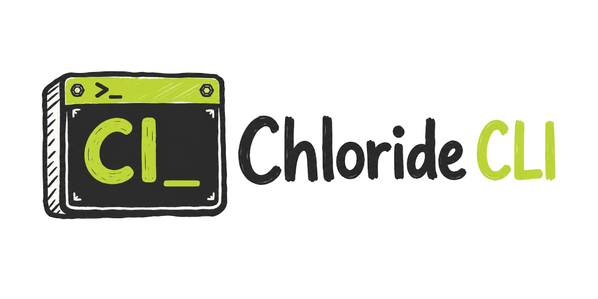

<div align="center">
  

  <h3>🧪 all-in-one DevOps utils CLI</h3>

  <p>
    Fast Rust CLI and terminal UI for Chloride: file uploads with shareable
    links, an inline fuzzy-ish <code>find</code> with live preview, quota
    checks, URL regeneration, and local file management — in one small,
    self-updating binary.
  </p>

  <p>
    <a href="https://github.com/AyushChauhan9389/chloride/releases/latest"></a>
    <a href="https://github.com/AyushChauhan9389/chloride/actions/workflows/release.yml"></a>
    
  </p>
</div>

## Install

Linux:

```bash
curl -fsSL https://chloride.carbonkit.tech/install | sh
```

Windows (PowerShell):

```powershell
irm https://chloride.carbonkit.tech/install.ps1 | iex
```

Both scripts download the latest release binary from GitHub, verify its SHA-256
checksum, and put `cl` on your `PATH`. Override the destination with
`CL_INSTALL_DIR`.

## Features

- **`cl find`** — name + content search built on ripgrep's engine, with an
  inline interactive picker: live results, match highlighting, emoji file
  badges, and a preview pane that follows the cursor
- **Uploads** with an inline expiry picker, live progress bars, and shareable
  short links
- **Fullscreen TUI** for remote files and a local file manager
- Login/register against the Chloride API, with auto-refreshing tokens
- Storage quota and usage at a glance
- Regenerate raw presigned URLs for uploaded files
- Keeps itself up to date from GitHub Releases
- One small static binary; config lives at `~/.config/chloride/config.json`

## API

Default API base URL:

```text
https://chloride.carbonkit.tech
```

The CLI stores this in the config file and uses bearer auth for protected API calls.

## Build

```bash
cargo build
```

Release build:

```bash
cargo build --release
```

The binary is configured as `cl`:

```text
target/release/cl
```

On Windows:

```text
target\release\cl.exe
```

## Usage

Launch the default TUI:

```bash
cl
```

or:

```bash
cl tui
```

Auth:

```bash
cl login
cl register
cl logout
cl whoami
```

Quota:

```bash
cl quota
```

Print the logo (truecolor terminal art; falls back to monochrome braille in
pipes or with `NO_COLOR`):

```bash
cl logo
```

The art is pre-rendered from `assets/logo/chloride-cli-lockup.svg` and
embedded in the binary — regenerate it after a logo change with
`python3 scripts/logo-to-ansi.py` (needs `rsvg-convert` and ImageMagick).

Upload:

```bash
cl upload ./file.zip
```

Skip the interactive expiry picker:

```bash
cl upload ./file.zip --expires-in 604800
```

Regenerate raw presigned URLs:

```bash
cl regenerate
```

or by file ID:

```bash
cl regenerate 123
```

Local file commands:

```bash
cl touch file.txt
cl mkdir folder
cl rm file.txt
cl pwd
```

## Find

Search file contents (regex, smart-case) and file names in one walk:

```bash
cl find token            # content search, opens the inline picker
cl find '*.zip'          # glob patterns search file names automatically
cl find -f zip           # force a name search
cl f token src/          # alias, and an optional root directory
```

On a terminal this opens an **inline picker** — a fixed-height block that
redraws in place, so your scrollback stays clean. Results stream in live,
grouped by file, with the matched term highlighted and a preview pane beside
the list on wide terminals.

| Key | Action |
|---|---|
| `↑` / `↓` | jump to the previous / next **file** |
| `Ctrl+↑` / `Ctrl+↓` (or `k` / `j`) | move one **line** at a time |
| `Enter` | print the selection (`path` or `path:line`) and exit |
| `e` | open the hit in `$EDITOR` at the matched line |
| `/` | edit the query live |
| `Tab` | unfold / fold results past the content cap |
| `Ctrl+p` | toggle the preview pane |
| `Esc` / `q` | cancel |

Interactive searches stop at 500 hits by default — past that nobody scrolls and
the UI spends its time sorting instead of drawing. Narrow the query, or raise
the cap with `-m`. Piped output is never capped, so `cl find x | wc -l` is a
real count. The same rules apply to the TUI's `/` search.

The picker draws on **stderr** and prints the selection on **stdout**, so it
composes: `cl upload "$(cl find zip)"` shows the picker, then uploads what you
picked. Without a terminal (CI, pipes with `--no-input`) results stream as
plain lines instead:

```bash
cl find -l TODO                  # just the file names
cl find TODO --no-input | wc -l  # stream, don't prompt
cl find -f '*.log' -0 | xargs -0 rm
```

Dotfiles are searched by default (`.env`, `.github/` — the ones you actually
want), `.git/` never is, and `.gitignore` rules apply unless you pass `-I`.
Set `CL_NO_EMOJI=1` if your terminal font renders the file badges as boxes.

## Updating

`cl` updates itself. Once a day it checks GitHub Releases and, if a newer
version exists, downloads and swaps in the new binary. The update lands on your
*next* `cl` run — the command you actually typed is never interrupted.

Update right now instead of waiting:

```bash
cl update
```

Turn the automatic check off:

```bash
export CL_NO_UPDATE=1
```

The automatic check is skipped whenever stderr isn't a terminal, so scripts and
CI never get a binary swapped underneath them. A failed check never fails your
command.

## TUI Keys

Default view is uploaded files from the API.

- `j` / `k` or arrow keys: move
- `g` / `G`: jump to first / last
- `Enter`: show selected file info
- `r`: refresh
- `f`: switch between remote files and local file manager
- `L`: login form
- `S`: register form
- `u`: quota overlay
- `/`: live search over the current directory
- `q`: quit

The in-TUI search (`/`) runs the same engine and behaves the same as the
inline `cl find` picker — same mode inference, same result order, same
`↑↓` file / `Ctrl+↑↓` line keys, same `Tab` fold. `Enter` jumps the file
manager to the hit.

Remote files view also supports:

- `R`: regenerate presigned URLs for the selected file
- `c`: copy the short download URL to the clipboard
- `D`: download the selected file to the current directory
- `d`: delete the selected remote file (confirms first)

Local file manager mode also supports:

- `t`: create file
- `m`: create directory
- `d`: delete selected item
- `U`: upload the selected file
- `Backspace` / `h`: go up

## Releasing

Everything is built on GitHub Actions — nothing is built or uploaded from your
machine. `.github/workflows/release.yml` does the work, and the tag you choose
is the version.

You never edit a version by hand. `scripts/set-version.sh` owns every
version-carrying file:

| File | What it sets |
|---|---|
| `Cargo.toml` | `[package] version` |
| `Cargo.lock` | the `chloride-tui` entry (so `--locked` builds stay valid) |
| `installer/nsis/chloride-cli.nsi` | `APP_VERSION` |

The workflow runs it twice: once **before building**, so `cl --version` and the
self-updater agree with the tag, and once **after publishing**, committing the
result back to `main` as `chore: set version to X` so the repo never drifts
behind the released version. That commit lands after the tag, so the tag's tree
still shows the previous number — the published binary is always correct
regardless.

To add another file that carries a version, add it to `apply_all()` in the
script and both paths pick it up. Run it by hand with
`scripts/set-version.sh 1.2.3`, or check the logic with
`scripts/set-version.sh --self-test`.

### The pre-push hook (easiest)

Enable it once per clone:

```bash
git config core.hooksPath .githooks
```

Now every `git push` of `main` asks whether this push is a release:

```text
  🧪 Chloride — pushing main
  latest release: v1.4.2

  Cut a release?
    p  patch  → v1.4.3
    m  minor  → v1.5.0
    M  major  → v2.0.0
    n  no release, just push (default)

  choice [n]:
```

Pick a bump and it tags the commit you're pushing, pushes the tag, and prints
the Actions link. Pick `n` (or just hit Enter) and it's an ordinary push.

The prompt only appears for `main`/`master`, only when a terminal is attached
— IDE pushes and CI never get prompted — and `CL_NO_RELEASE=1 git push` skips
it for one push. Run `.githooks/pre-push --self-test` to check the bump math.

### By hand

```bash
git tag v1.2.3
git push origin v1.2.3
```

Or run the **release** workflow from the Actions tab and type the version there
(with an optional pre-release checkbox).

Each release gets:

| Asset | Platform |
|---|---|
| `cl-x86_64-unknown-linux-musl` | Linux x86_64, statically linked |
| `cl-x86_64-pc-windows-msvc.exe` | Windows x86_64 |
| `*.sha256`, `SHA256SUMS` | checksums |

Assets are plain uncompressed binaries, not archives — the install scripts and
the updater fetch them straight from `/releases/latest/download/<asset>`.

**The repo must be public** (or the install scripts and updater need a token) —
both hit the unauthenticated GitHub API.

## Windows Installer

NSIS installer configuration lives at:

```text
installer/nsis/chloride-cli.nsi
```

Build the release binary first:

```powershell
cargo build --release
```

Then build the installer on Windows with NSIS:

```powershell
makensis installer\nsis\chloride-cli.nsi
```

The installer installs `cl.exe` to:

```text
%LOCALAPPDATA%\Programs\Chloride
```

It also adds that directory to the user `PATH`, so new terminals can run:

```powershell
cl
```

## Config

User config is stored at:

```text
~/.config/chloride/config.json
```

It contains the base URL, access token, refresh token, and cached user info.
